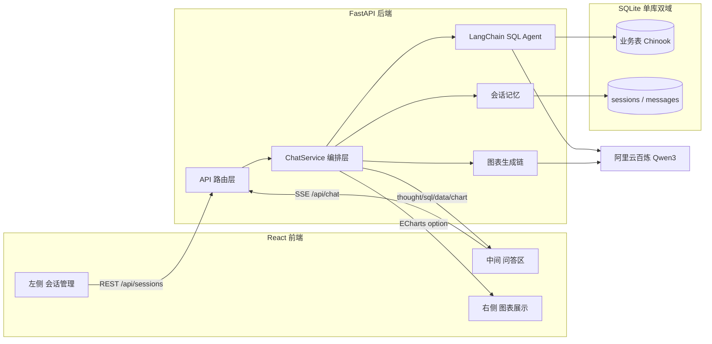
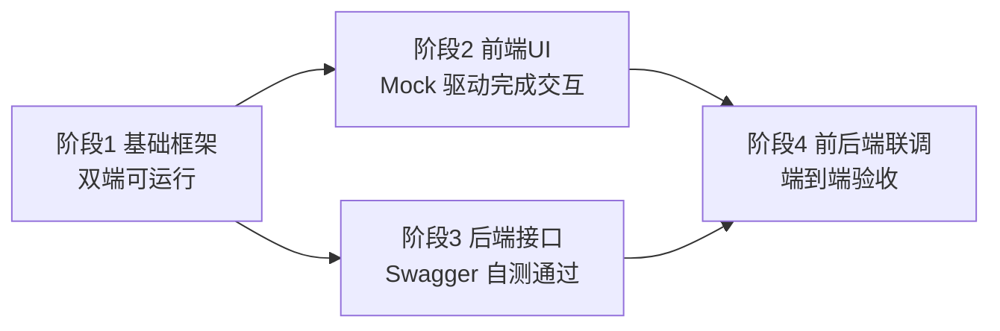

# NL2SQL 智能数据分析系统 - 模块规划

## 一、整体架构



核心流程：用户提问 → 后端加载会话历史（Memory）→ SQL Agent 多轮调用 Qwen3 自动探查 schema、生成 SQL、执行、自愈 → 结果交给图表生成链产出 ECharts option → SSE 分段推送 `thought/sql/data/chart/final` 事件给前端。

## 二、技术栈锁定

- **后端**：Python 3.11 + FastAPI + LangChain（`langchain`、`langchain-community`、`langchain-openai`） + SQLAlchemy + aiosqlite + `sse-starlette` + pydantic-settings
- **LLM 接入**：阿里云百炼 OpenAI 兼容端点 `https://dashscope.aliyuncs.com/compatible-mode/v1`，通过 `langchain_openai.ChatOpenAI` 直接对接 Qwen3（`qwen3-max` / `qwen3-plus`），`DASHSCOPE_API_KEY` 注入为 `openai_api_key`
- **数据库**：单个 `app.db`（SQLite3），内建 Chinook 示例数据集 + 应用表 `sessions` / `messages`
- **前端**：React 18 + Vite + TypeScript + Ant Design 5 + `echarts` + `echarts-for-react` + Zustand + `@microsoft/fetch-event-source`（SSE 客户端，支持 POST）

## 三、后端模块设计（FastAPI + LangChain）

目录结构：

```
backend/
  app/
    main.py                  # FastAPI 入口、CORS、路由注册
    config.py                # pydantic-settings 读取 .env
    llm/
      qwen.py                # ChatOpenAI 包装百炼 Qwen3
    db/
      engine.py              # SQLAlchemy 引擎（同一 app.db）
      models.py              # Session / Message ORM
      seed_chinook.py        # 首次启动自动建表+灌示例数据
    agent/
      sql_agent.py           # create_sql_agent + SQLDatabaseToolkit
      chart_chain.py         # 根据 columns+rows 产出 ECharts option
      prompts.py             # 系统提示词（中文、安全约束、只读）
    memory/
      sqlite_history.py      # 自定义 BaseChatMessageHistory，读写 messages 表
    services/
      chat_service.py        # 编排：取历史→跑 Agent→生成图→落库→产出 SSE 事件
      session_service.py     # 会话 CRUD
    api/
      sessions.py            # /api/sessions 会话增删改查 + 消息历史
      chat.py                # /api/chat (SSE) 核心问答
      schema.py              # /api/schema 返回业务表结构供前端展示
    schemas.py               # Pydantic 请求/响应模型
  requirements.txt
  .env.example               # DASHSCOPE_API_KEY / QWEN_MODEL / DB_PATH
```

### 3.1 关键模块要点

- **`llm/qwen.py`**：统一出口，返回 `ChatOpenAI(model=..., base_url=..., api_key=..., stream_usage=True)`，区分「Agent 用模型（温度 0）」和「图表生成模型（温度 0.2）」；参数契约见 §3.4.1。
- **`agent/sql_agent.py`**：按 LangChain v1 官方 SQL Agent 教程实现——`SQLDatabase.from_uri(uri, include_tables=[...], sample_rows_in_table_info=3)` + `SQLDatabaseToolkit(db=db, llm=model).get_tools()` 得到 4 个固定工具（`sql_db_list_tables` / `sql_db_schema` / `sql_db_query_checker` / `sql_db_query`） + `langchain.agents.create_agent(model, tools, system_prompt=...)`；只读保障为白名单 + 子类化 `QuerySQLDatabaseTool`（或 SQLAlchemy 连接 `uri?mode=ro`）拦截 `INSERT/UPDATE/DELETE/DROP/ALTER/TRUNCATE/REPLACE`。**旧版 `create_sql_agent(agent_type="openai-tools")` / `return_intermediate_steps=True` 已废弃**，中间步骤改从 `astream_events(v2)` 中以 `on_tool_start / on_tool_end` 事件获取。
- **`agent/chart_chain.py`**：输入 `user_question + sql + columns + rows(截断前 200 行) + summary` → 输出严格 JSON `{chartType, echartsOption, insight}`；用 `JsonOutputParser` + `PydanticOutputParser` 做结构化约束，失败回退为「表格」。
- **`memory/sqlite_history.py`**：实现 `BaseChatMessageHistory`（`add_message` / `messages` / `clear`），把每轮 Human/AI/Tool 消息持久化到 `messages` 表；在 `chat_service` 中以 `history.messages + [HumanMessage(question)]` 组装 `create_agent` 的输入，自动保留上下文。
- **`services/chat_service.py`**：生成器函数 `async def stream_chat(session_id, question)`，使用 Agent 的 `astream_events(v2)` 逐事件转成 SSE payload（**完整映射见 §3.4.6**）：
  - `thought`：`on_chat_model_stream` 的非空 `chunk.content`
  - `sql`：`on_tool_start` 且 `event.name == "sql_db_query"` 时从 `event.data.input["query"]` 抽取
  - `data`：`on_tool_end` 且 `event.name == "sql_db_query"` 时解析 `event.data.output` 为 `{columns, rows}`
  - `chart`：整个 `create_agent` 结束后调用 chart_chain 产出 ECharts option
  - `final`：最终 `AIMessage.content` 自然语言总结 + `usage_metadata`
  - `error`：`invalid_tool_calls` 或 `additional_kwargs.refusal` 非空时触发
  - `done`：流结束信号

### 3.2 数据库 schema（应用表）

```sql
CREATE TABLE sessions (
  id TEXT PRIMARY KEY,           -- uuid
  title TEXT NOT NULL,
  created_at DATETIME,
  updated_at DATETIME
);
CREATE TABLE messages (
  id INTEGER PRIMARY KEY AUTOINCREMENT,
  session_id TEXT NOT NULL,
  role TEXT NOT NULL,            -- user / assistant / tool
  content TEXT NOT NULL,         -- 文本或 JSON 字符串
  meta_json TEXT,                -- sql / chart_option / rows 等附加信息
  created_at DATETIME
);
```

### 3.3 API 清单

- `GET /api/sessions` 列出会话
- `POST /api/sessions` 新建会话（首问自动用 LLM 生成标题）
- `PATCH /api/sessions/{id}` 重命名
- `DELETE /api/sessions/{id}` 删除
- `GET /api/sessions/{id}/messages` 获取完整历史（含 SQL / 图表 option）
- `POST /api/chat` （SSE）请求体 `{session_id, question}`，流式返回 `event: thought|sql|data|chart|final`
- `GET /api/schema` 返回业务表名、列、前几行示例，供前端右侧「数据字典」折叠面板展示

### 3.4 LLM 响应字段规范（基于 qwen3-max 实测契约）

> 本节为 **Phase 3 后端与 LangChain 交互时的强约束**。所有字段取值与层级均来自 `backend/scripts/test_qwen_integration.py` 在百炼 OpenAI 兼容端点 `https://dashscope.aliyuncs.com/compatible-mode/v1` 上的真实抓取结果（模型 `qwen3-max`，`langchain-openai==0.3.35` / `langchain-core==0.3.84` / `openai==2.32.0`）。
> 任何依赖 `AIMessage` / `AIMessageChunk` / `astream_events` 的模块（`chat_service.py`、`sql_agent.py`、`chart_chain.py`、`memory/sqlite_history.py`）必须按此规范处理。

#### 3.4.1 `ChatOpenAI` 初始化参数约束

```python
ChatOpenAI(
    model=settings.qwen_model,                    # "qwen3-max"（禁止硬编码）
    base_url=settings.qwen_base_url,              # 以 /compatible-mode/v1 结尾
    api_key=settings.dashscope_api_key,           # 禁止入库
    temperature=0.0,                              # SQL Agent 用 0；chart_chain 用 0.2
    timeout=60,
    max_retries=2,
    stream_usage=True,                            # 必须开启，否则流式下拿不到 token 用量
)
```

- **`stream_usage=True` 为强制项**：百炼流式默认不发 `stream_options.include_usage`，不开启时 `chunk.usage_metadata` 全程为 `None`，无法做计费 / Token 上报。
- **Agent 与 chart_chain 使用独立实例**：温度、max_tokens、超时策略不同，禁止共享单例。

#### 3.4.2 非流式 `AIMessage` 字段（`invoke()` 返回值）

| 字段 | 类型 | 是否必有 | Phase 3 用途 | 备注 |
|---|---|---|---|---|
| `content` | `str` | 有 | 写入 `messages.content`（role=assistant） | 纯文本回复时为完整答案；**工具调用时为 `""`** |
| `id` | `str`（`run--...`） | 有 | 落库到 `messages.meta_json.run_id` | LangChain 生成的 run id，可串联 trace |
| `response_metadata.model_name` | `str` | 有 | 落库校验（必须 == `qwen3-max`） | |
| `response_metadata.finish_reason` | `"stop"` / `"tool_calls"` / `"length"` / `"content_filter"` | 有 | 决定是否继续 Agent 循环 | `"tool_calls"` → 还要跑工具；`"stop"` → 终局 |
| `response_metadata.id` | `str`（`chatcmpl-...`） | 有 | 百炼侧的 request id，排障用 | 与 `AIMessage.id` 不同 |
| `response_metadata.token_usage.prompt_tokens_details.cached_tokens` | `int` | 有 | 百炼缓存命中 token 数 | **百炼特有**，计费时别漏算 |
| `response_metadata.system_fingerprint` | `null` | 无 | 不要读 | 百炼不返回，保留字段结构 |
| `response_metadata.service_tier` | `null` | 无 | 不要读 | 同上 |
| `response_metadata.logprobs` | `null` | 无 | 不要读 | 同上 |
| `usage_metadata.input_tokens` | `int` | 有 | Token 计费主字段 | |
| `usage_metadata.output_tokens` | `int` | 有 | 同上 | |
| `usage_metadata.total_tokens` | `int` | 有 | 同上 | |
| `usage_metadata.input_token_details.cache_read` | `int` | 有 | LangChain 归一化后的缓存命中数 | 等同于上面的 `cached_tokens` |
| `additional_kwargs.refusal` | `null` / `str` | 有 | 非空时表示被百炼内容安全拦截 | 需落库并向前端推送 `error` 事件 |
| `tool_calls` | `list` | 有 | 见 §3.4.4 | 普通对话下为 `[]` |
| `invalid_tool_calls` | `list` | 有 | 见 §3.4.4 | 解析失败才会有值，需告警 |

#### 3.4.3 流式 `AIMessageChunk` 字段规则（`stream()` / `astream()` 返回迭代器）

每次回答在百炼端大约拆成 **N 个 chunk**（普通回答约 10 个；工具调用约 10 个），遵循以下规则：

1. **第 1 个 chunk（握手）**：`content == ''`，`response_metadata == {}`，`usage_metadata is None`。**不要** 把这个 chunk 的 `content` 推给前端，会产生一个空气泡。
2. **中间 chunks（文本主体）**：`content` 为非空字符串片段（通常 1~8 个字符），按 `content += chunk.content` 拼接即得到最终答案。
3. **最后一个 chunk（收尾）**：`content == ''`，`response_metadata == {"finish_reason": ..., "model_name": "qwen3-max"}`，`usage_metadata` 仅在 `stream_usage=True` 时出现。**后端必须以 `finish_reason` 的出现作为关闭 SSE 流的信号**，不要以 chunk 迭代器结束来判（有心跳 chunk 的可能）。
4. **累加语义**：`AIMessageChunk.__add__` 已实现合并逻辑，`accumulated = reduce(operator.add, chunks)` 得到的对象字段与 §3.4.2 的 `AIMessage` 等价，**可直接作为落库对象**。
5. **`id` 字段**：同一次响应的所有 chunk 共享同一个 `run--...` id，可用于幂等去重。

#### 3.4.4 Tool Calling 非流式字段契约（**关键**）

调用 `llm.bind_tools([...]).invoke(...)` 并触发工具时，返回的 `AIMessage` 存在 **两套表达**，必须区分使用：

**A. LangChain 标准抽象 —— `AIMessage.tool_calls`（Phase 3 主用）**

```json
[
  {
    "name": "sql_db_query",
    "args": { "query": "SELECT COUNT(*) FROM Artist;" },
    "id": "call_f9108a44e86e4418a312387e",
    "type": "tool_call"
  }
]
```

- `args` 已经是 **解析好的 dict**，可以直接丢给工具执行器，**不要再 json.loads**。
- `id` 即 `tool_call_id`，在后续 `ToolMessage` 中用 `tool_call_id=id` 回传结果，**不可省略**。
- **支持并行**：Qwen3-max 实测会一次性返回多个 tool_call（例如同时触发 `sql_db_query` 和 `sql_db_schema`），后端执行时必须按数组全部消费，不要只取第一个。
- 与之对称的字段 `invalid_tool_calls`：当模型吐出的 `arguments` 不是合法 JSON 时落到这里（含 `error` 字段），此时必须 **推 `error` 事件到前端** 并中止本轮 Agent。

**B. OpenAI 原生 payload —— `AIMessage.additional_kwargs.tool_calls`（仅在透传到 OpenAI SDK 时使用）**

```json
[
  {
    "id": "call_xxx",
    "type": "function",
    "index": 0,
    "function": {
      "name": "sql_db_query",
      "arguments": "{\"query\": \"SELECT ...\"}"   // 字符串，未解析
    }
  }
]
```

- `function.arguments` 是 **未解析的 JSON 字符串**。
- **Phase 3 原则**：除非要把消息原样回传给 OpenAI Chat Completions API，否则一律用 A 套。

其他字段：
- `content == ''`（工具调用轮次 assistant 无文本输出）
- `response_metadata.finish_reason == "tool_calls"`
- `usage_metadata` 正常有值

#### 3.4.5 Tool Calling 流式字段契约（SSE 事件驱动的核心）

工具调用在流式下按 **增量 chunk** 交付，必须使用 `tool_call_chunks` 字段（**不是 `tool_calls`**，后者在中间 chunk 上是空的）：

| chunk 序号 | `tool_call_chunks` 典型值 | 含义 |
|---|---|---|
| 第 1 个工具的首 chunk | `{name: "sql_db_query", args: "", id: "call_xxx", index: 0, type: "tool_call_chunk"}` | 函数名 + 调用 id + 占位 index |
| 第 1 个工具的后续 chunks | `{name: null, args: "{\"query\": \"SEL", id: "", index: 0}` | **仅 `args` 字段增量追加 JSON 字符串片段** |
| 第 2 个并行工具的首 chunk | `{name: "sql_db_schema", args: "", id: "call_yyy", index: 1, ...}` | 通过 `index` 区分不同并行调用 |
| 末尾 chunk | `tool_call_chunks: []`, `response_metadata.finish_reason: "tool_calls"` | 结束信号 |

**落地规则**：
1. **合并必须按 `index`**：相同 `index` 的 chunk 的 `args` 字符串按到达顺序拼接，**不要按 `id` 合并**（中间 chunk 的 id 是空字符串）。
2. **推荐用原生 `__add__`**：`acc = acc + chunk`，LangChain 会自动：
   - 按 `index` 拼接 `args` 字符串
   - 到流式结束时把完整的 `args` 字符串 `json.loads` 成 dict 并填到 `acc.tool_calls[i].args`
   - 因此 **最终累加对象的 `tool_calls` 字段等价于非流式 `AIMessage.tool_calls`**，可直接落库。
3. **何时推送 SSE `sql` 事件**：  
   - **不要** 在每个 chunk 都推，否则前端会收到 `{"query": "SEL` 这样的乱码片段。  
   - 推荐使用 `agent.astream_events(v2)` 的 `on_tool_start` 事件（此时 `data.input` 已是解析好的 args dict），或监听 `on_tool_end`（此时同时可以拿到 `output` 作为 `data` 事件载荷）。

#### 3.4.6 `astream_events(v2)` → SSE 事件映射表

Phase 3 `chat_service.stream_chat()` 必须按下表转换 LangChain 事件为前端 SSE 事件。**`SQLDatabaseToolkit.get_tools()` 返回的 4 个工具名固定为**：`sql_db_list_tables` / `sql_db_schema` / `sql_db_query_checker` / `sql_db_query`，映射时必须精确按名字过滤。

| LangChain 事件（v2） | 触发条件 | 取值字段 | 映射到 SSE event | SSE data 结构 |
|---|---|---|---|---|
| `on_chat_model_stream` | 模型流式 token（工具调用前的推理 / 最终总结） | `event.data.chunk.content`（非空） | 未触发 `sql_db_query` 前 → `thought`；已触发过 `sql_db_query` 后 → `final`（增量 delta） | `{ delta: string }` |
| `on_tool_start` · `sql_db_list_tables` | 列表工具开始 | `event.name` | `thought`（一条简短提示，如"正在列出可用表…"） | `{ delta: string }` |
| `on_tool_start` · `sql_db_schema` | 取 schema 开始 | `event.data.input["table_names"]` | `thought`（"正在查看表结构：Track, Genre…"） | `{ delta: string }` |
| `on_tool_start` · `sql_db_query_checker` | 预检查开始 | `event.data.input` | `thought`（"正在预检查 SQL…"） | `{ delta: string }` |
| `on_tool_start` · `sql_db_query` | **执行 SQL** 开始 | `event.data.input["query"]` + `event.run_id` + `tool_call_id` | `sql` | `{ tool_call_id, query }` |
| `on_tool_end` · `sql_db_query` | 执行结果返回 | `event.data.output` + `tool_call_id` | `data` | `{ tool_call_id, columns: string[], rows: any[][], truncated: boolean }`（行数 > 200 截断并置 `truncated=true`，且保留最近一次 `{columns, rows}` 供 chart_chain 消费）|
| `on_tool_end` · 其他工具 | 返回 | — | 忽略（不外推 SSE） | — |
| `on_chain_end`（root） | 整个 Agent 结束 | 最终 `AIMessage.content` + `usage_metadata` | 先触发 chart_chain（以最近一次 `{columns, rows, sql}`） → `event: chart`；然后 `event: final` | `chart`: `{ chartType, echartsOption, insight }`；`final`: `{ content, run_id, usage }` |
| `on_chat_model_end` 的 `AIMessage.invalid_tool_calls` 非空 | 参数解析失败 | `invalid_tool_calls[0].error` | `error` | `{ code: "invalid_tool_args", message }` |
| `AIMessage.additional_kwargs.refusal` 非空 | 内容安全拦截 | `refusal` | `error` | `{ code: "refusal", message }` |
| 流自然结束 | — | — | `done` | `{}` |

**公共约束**：
- SSE 每个事件末尾追加 `\n\n`；最终必须再发一条 `event: done`（`data: {}`）以便前端 `fetchEventSource` 干净关闭。
- 所有 event 的 `data` 字段走 `json.dumps(..., ensure_ascii=False)`，且 `ensure_ascii=False` 不能与 `sse_starlette` 的 `ping=15` 冲突。

#### 3.4.7 `messages` 表落库字段约束（与前端回放对齐）

| 列 | 约束 | 示例 |
|---|---|---|
| `role` | `"user"` / `"assistant"` / `"tool"` | 与 LangChain `BaseMessage.type` 一致 |
| `content` | 非空字符串；assistant 只有工具调用无文本时写 `""` | |
| `meta_json.run_id` | `AIMessage.id` | 用于去重 |
| `meta_json.tool_calls` | §3.4.4 A 套原样 | **不要** 存 B 套 |
| `meta_json.tool_call_id` | role=tool 时必填 | 对应 A 套的 `id` |
| `meta_json.sql` | role=assistant 且触发过 `sql_db_query` 时填写 | 前端回放时恢复 SQL Tab |
| `meta_json.columns` / `meta_json.rows` | 同上 | 截断后的结果 |
| `meta_json.echarts_option` | 触发过 chart_chain 时填写 | 前端回放时恢复图表 |
| `meta_json.usage` | `{input_tokens, output_tokens, cache_read}` | 来自 `usage_metadata` |
| `meta_json.finish_reason` | `response_metadata.finish_reason` | 用于排障 |

#### 3.4.8 常见陷阱与规避清单

1. **流式下 `usage_metadata` 为 `null`** —— 忘开 `stream_usage=True`。
2. **只消费了第一个工具调用** —— Qwen3-max 支持并行 tool_calls，必须遍历 `tool_calls` 数组。
3. **对 `additional_kwargs.tool_calls[*].function.arguments` 做 json.loads** —— 正确做法是读 `AIMessage.tool_calls[*].args`（已是 dict）。
4. **用 `chunk.tool_calls` 做流式工具捕获** —— 错误：中间 chunk 的 `tool_calls` 为 `[]`，必须用 `tool_call_chunks`，或直接用 `astream_events(v2)` 的 `on_tool_start`。
5. **按 chunk 粒度向前端推 `sql` 事件** —— 会看到 JSON 片段。正确做法见 §3.4.6。
6. **把第一个握手 chunk 的空 content 作为一次 delta 推送** —— 会产生空气泡，需先过滤 `if chunk.content`。
7. **以 chunk 迭代器结束作为流式结束** —— 应在出现 `response_metadata.finish_reason` 时置 `done` 标记，防止中途心跳误判。
8. **忽略 `additional_kwargs.refusal`** —— 非空时表示百炼安全拦截，必须单独处理。

#### 3.4.9 契约回归脚本

- 文件：`backend/scripts/test_qwen_integration.py`（已在 `backend/.gitignore` 的 `scripts/` 规则中排除，含 API Key 不入库）
- 命令：
  ```
  .\.venv\Scripts\python scripts/test_qwen_integration.py                # 全量跑
  .\.venv\Scripts\python scripts/test_qwen_integration.py --only invoke
  .\.venv\Scripts\python scripts/test_qwen_integration.py --only stream
  .\.venv\Scripts\python scripts/test_qwen_integration.py --only tool
  .\.venv\Scripts\python scripts/test_qwen_integration.py --only tool-stream
  ```
- **Phase 3 开发规则**：升级 `langchain-openai` / 更换 Qwen3 版本 / 调整百炼 base_url 后，必须先重跑该脚本，确认字段结构未变（特别是 `tool_calls` / `tool_call_chunks` / `finish_reason` / `usage_metadata` 四类），再合并到 main。

### 3.5 前端对接契约（Phase 4 联调强约束）

> 本节为 **Phase 4 前后端联调时的强约束**，字段与协议以 Phase 3 实际落库的 `backend/app/schemas.py`（Pydantic v2，`alias_generator=to_camel`，`populate_by_name=True`）与 `backend/app/services/chat_service.py` 的 SSE 产出为权威。
> 前端 `frontend/src/types.ts` + `frontend/src/api/*` + `frontend/src/store/useChatStore.ts.applyEvent` 已于 Phase 3 末按本节调整完毕；任何字段/协议歧义一律以本节为准。
>
> **动态验证**：本节所有字段形状已由 `backend/scripts/probe_contract.py` 对真实运行后端（127.0.0.1:8000）逐个端点打穿抓包核对，包括：`/api/ping`、`/api/sessions`（list/create/patch/delete）、`/api/sessions/{id}/messages`（含空会话与含一轮问答两种状态）、`/api/schema`、`/api/chat`（SSE 6 种事件全部命中）。升级 Pydantic schemas / Qwen3 版本 / LangChain astream_events 映射后，必须重跑该脚本确认契约未漂移。

#### 3.5.1 REST 字段契约矩阵

| 接口 | 方向 | 后端 DTO（权威） | 前端类型 / 调用签名 | 关键点 |
|---|---|---|---|---|
| `GET /api/sessions` | 响应 | `List[SessionOut]` | `Session[]` | `preview` 可为 `null`，前端类型必须 `string \| null \| undefined` |
| `POST /api/sessions` | 请求 | `SessionCreate {title?: str}` | `createSession(title?: string)` | 空 title 由后端兜底为"新会话" |
| `POST /api/sessions` | 响应 | `SessionOut` | `Session` | 同上 |
| `PATCH /api/sessions/{id}` | 请求 | `SessionUpdate {title: str}` | `renameSession(id, title)` | `title` 必填 |
| `PATCH /api/sessions/{id}` | 响应 | `SessionOut` | `Session` | |
| `DELETE /api/sessions/{id}` | 响应 | `204 No Content` | `Promise<void>` | 前端不要尝试 `response.json()` |
| `GET /api/sessions/{id}/messages` | 响应 | `List[MessageOut]` | `ChatMessage[]` | 需适配器（§3.5.3），直接套型会丢 `meta` |
| `GET /api/schema` | 响应 | `SchemaOut {tables: SchemaTable[]}` | `SchemaTable[]` | **前端必须解包 `.tables`**，不可当数组直接用 |
| `POST /api/chat` | 请求 | `ChatRequest {sessionId, question}` | `runChat({sessionId, question, onEvent, signal})` | camelCase 别名由 `populate_by_name=True` 兼容 |
| `POST /api/chat` | 响应 | `text/event-stream` | `ChatEvent` 联合类型 | 见 §3.5.2 |

#### 3.5.2 SSE 事件语义对前端 store 的硬约束

后端 `chat_service.stream_chat` 推送的事件在前端 `useChatStore.applyEvent` 中的处理方式**不可逆地**按以下语义：

| 事件 | 语义 | 前端 store 处理 | 常见错误 |
|---|---|---|---|
| `thought` | **增量 delta** | `meta.thought = (meta.thought ?? '') + event.delta` | — |
| `sql` | **覆盖式一次性** | `meta.sql = event.sql` | 拼接会得到 `SELECTSELECT…` |
| `data` | **覆盖式一次性** | `meta.data = event.data` | — |
| `chart` | **覆盖式一次性** | `meta.chart = event.chart` | 同时写入 `useChartStore.setChart` |
| `final` | **一次性全量**（Agent 结束时仅发一次完整文本） | `meta.final = event.delta`（**直接覆盖**） | **禁止累加**，Qwen3 ReAct 过程中的中间文本会与 final 叠加出现"答案重复" |
| `done` | 连接终结信号 | `meta.status = 'done'`，解除 streaming 态 | 收到 error 后仍须发 done |
| `error` | 终结错误 | `meta.status = 'error'`, `meta.error = event.message` | 前端展示 Alert + 关闭流 |

> 与 §3.4.6 的 LangChain→SSE 映射互为表里：§3.4.6 规定后端"怎么发"，§3.5.2 规定前端"怎么收"。mock 层（`frontend/src/mocks/mockSSE.ts`）也必须遵循同一套语义，以保证 mock 与真实后端下 store 的行为一致。

#### 3.5.3 `MessageOut` → `ChatMessage` 适配规则

后端 `MessageOut` 两种形态，前端 `ChatMessage` 是 tagged union，必须用适配器转换（见 `frontend/src/api/sessions.ts.adaptMessage`）：

| 后端字段 | user 消息 | assistant 消息 |
|---|---|---|
| `role` | `"user"` | `"assistant"` |
| `content` | 问题文本（非空字符串） | **始终为 `null`**（`session_service.list_messages` 不回填 content，答案正文统一放在 `meta.final`） |
| `meta` | `null` | `AssistantMeta`（详见 §3.4.7 落库字段） |

前端适配逻辑：
- `role == 'user'` → `UserMessage { content: content ?? '' }`
- `role == 'assistant'` →
  - `meta` 非空（正常路径，100% 场景）：原样装入 `AssistantMessage.meta`，由于 `content` 恒为 null，`final` 直接取 `meta.final`
  - `meta` 为空（历史数据异常兜底，理论上不会出现）：构造 `{status: 'done', final: content, startedAt: createdAt}`

#### 3.5.4 可空字段清单（Pydantic `None` ↔ TS `null`）

严格模式 TS 下 `preview?: string` 不能接收 `null`，必须显式 `string | null | undefined`：

| 字段 | 后端（Python） | 前端（TS） |
|---|---|---|
| `Session.preview` | `str \| None` | `string \| null \| undefined` |
| `SchemaColumn.nullable` | `bool \| None` | `boolean \| null \| undefined` |
| `SchemaColumn.comment` | `str \| None` | `string \| null \| undefined` |
| `SchemaTable.comment` | `str \| None` | `string \| null \| undefined` |
| `ChartPayload.insight` | `str \| None` | `string \| null \| undefined` |
| `AssistantMeta.thought / sql / error / finishedAt / final` | 各自可空 | 同样放宽为 `\| null` |
| `AssistantMeta.startedAt` | 必有（Pydantic 默认 `datetime.now`） | `string`（非空） |
| `MessageOut.content` | `str \| None`（user 必有文本；assistant 回放时**始终为 null**） | `string \| null`（适配器按 role 分支处理） |

#### 3.5.5 Phase 4 切换点（一行 `import` 完成 mock → real）

前端 `frontend/src/api/` 已完整实现真实后端调用层，其函数签名与 `frontend/src/mocks/mockApi.ts` + `frontend/src/mocks/mockSSE.ts` **完全一致**。Phase 4 切换只需修改以下 3 处 import：

| 文件 | Phase 2/3（mock） | Phase 4（real） |
|---|---|---|
| `src/store/useSessionStore.ts` | `import * as api from '../mocks/mockApi'` | `import * as api from '../api'` |
| `src/store/useChatStore.ts` | `import * as api from '../mocks/mockApi'`<br/>`import { runMockChat } from '../mocks/mockSSE'` | `import * as api from '../api'`<br/>`import { runChat as runMockChat } from '../api'` |
| `src/components/ChartPanel/SchemaDrawer.tsx` | `import { fetchSchema } from '../../mocks/mockApi'` | `import { fetchSchema } from '../../api'` |

切换后需删除 `frontend/src/mocks/` 或保留作离线演示模式（建议留下，以便无 API Key 场景调试 UI）。

#### 3.5.6 Phase 4 联调自检清单

切换真实 API 后按此清单逐条验证，任何一条失败回滚 import 并对照 §3.5.1~§3.5.4 排查：

1. `GET /api/sessions` 新建会话 `preview == null`，`SessionList` 不崩溃、时间戳正常
2. 提交问题 → `StreamingBubble` 依次展示 `thought`（逐字累加）→ `sql`（代码块）→ `data`（预览表）→ `chart`（右侧 ECharts 同步出图）→ `final`（一次性整段答案）
3. 刷新页面 → 前端从 `/api/sessions/{id}/messages` 拉取后，历史 `StreamingBubble` 能完整回放 SQL / 数据 / 图表（`meta` 适配器工作正常）
4. 网络异常（kill 后端）→ 前端收到合成 `error` + `done`，UI 置 `error` 态且输入框恢复可用
5. CORS：`backend/app/config.py::cors_origin_list` 包含 `http://localhost:5173`；Vite 代理 `/api` 生效
6. DevTools Network：`/api/chat` 响应头 `Content-Type: text/event-stream`，`Transfer-Encoding: chunked`；无 `X-Accel-Buffering` 相关反代缓冲
7. 冒烟脚本 `backend/scripts/smoke_chat.py` 端到端通过（与前端切换无关，用于隔离后端回归）

## 四、前端模块设计（React 三栏布局）

目录结构：

```
frontend/
  src/
    App.tsx                     # 三栏 Layout（AntD）
    main.tsx
    api/
      client.ts                 # axios 基础实例 + /api/ping
      sessions.ts               # 会话/消息 REST + MessageOut→ChatMessage 适配器
      schema.ts                 # /api/schema 解包 {tables}
      chat.ts                   # @microsoft/fetch-event-source 封装 POST SSE
      index.ts                  # 统一出口（签名与 mocks/ 对齐，Phase 4 改一行 import 即切换）
    store/
      useSessionStore.ts        # sessions 列表、currentSessionId
      useChatStore.ts           # messages、流式中间态
      useChartStore.ts          # 当前活跃图表 option、历史图表
    components/
      SessionList/              # 左侧：新建/搜索/重命名/删除
      ChatPanel/
        MessageList.tsx         # 气泡、SQL 代码块、折叠思考过程
        StreamingBubble.tsx     # 边流边渲染
        ChatInput.tsx
      ChartPanel/
        ChartRenderer.tsx       # echarts-for-react 渲染 option
        ChartTabs.tsx           # 图表 / 数据表 / SQL 三 Tab
        SchemaDrawer.tsx        # 查看业务表结构
    types.ts
    vite.config.ts
```

布局（AntD `Layout`）：

```
┌──────────┬──────────────────────────┬───────────────────┐
│ Sider    │ Content                  │ Sider             │
│ 260px    │                          │ 480px             │
│ 会话列表 │ 问答消息流 + 输入框      │ ECharts 图表 +    │
│          │ (SSE 实时气泡)           │ 数据表 / SQL Tab  │
└──────────┴──────────────────────────┴───────────────────┘
```

### 4.1 SSE 流式渲染关键点

使用 `@microsoft/fetch-event-source` 的 `fetchEventSource(url, {method:'POST', body, onmessage})` 解决 EventSource 不支持 POST 的问题；按 `event` 字段分派：`thought` 追加到当前 assistant 气泡的「思考过程」区域，`sql` 渲染为代码块，`chart` 写入 `useChartStore` 触发右侧重绘，`final` 合并到正文。

## 五、研发阶段拆分（四阶段）

采用「**契约先行 + Mock 驱动**」的策略：阶段 1 先锁定接口契约，阶段 2 前端依 Mock 独立成型，阶段 3 后端按契约落地，阶段 4 移除 Mock 对接真实服务，最大化并行度、降低联调成本。



---

### 阶段 1：搭建前后端基础框架并运行测试（预计 0.5 天）

**目标**：双端工程可独立启动，前端能请求到后端 `/api/ping`，为后续开发打好地基。

**后端任务**
- 初始化 `backend/`：`requirements.txt`（fastapi / uvicorn / pydantic-settings / python-dotenv / sse-starlette）、`.env.example`、`.gitignore`
- `app/main.py`：创建 FastAPI 实例，启用 CORS（`http://localhost:5173`），注册一个健康检查路由 `GET /api/ping -> {"pong": true, "time": ...}`
- `app/config.py`：pydantic-settings 读取 `DASHSCOPE_API_KEY` / `QWEN_MODEL` / `DB_PATH` / `CORS_ORIGINS`
- 启动命令：`uvicorn app.main:app --reload --port 8000`

**前端任务**
- `npm create vite@latest frontend -- --template react-ts`
- 安装依赖：`antd`、`echarts`、`echarts-for-react`、`zustand`、`axios`、`@microsoft/fetch-event-source`、`dayjs`
- 配置 `vite.config.ts` 代理 `/api` → `http://localhost:8000`
- `App.tsx` 搭建 AntD 三栏 `Layout`（左 Sider 260 / Content / 右 Sider 480），每栏放占位文字
- `api/client.ts` axios 实例（baseURL `/api`，超时 30s）
- 在 `App.tsx` 挂载时请求 `/api/ping`，顶部 Header 显示「后端已连接 ✓ / ✗」

**验收标准**
- 后端：访问 `http://localhost:8000/api/ping` 返回 200 JSON；Swagger `http://localhost:8000/docs` 可见
- 前端：`npm run dev` 打开 `http://localhost:5173`，看到三栏布局 + Header 绿色「后端已连接」
- 交付：`backend/` 与 `frontend/` 两个目录可独立启动

---

### 阶段 2：研发前端 UI（Mock 驱动，预计 1.5 天）

**目标**：不依赖真实后端，用 Mock 数据跑通完整交互：选择会话 → 输入问题 → 气泡流式打字 → 右侧图表渲染。

**子任务 2.1 状态与 Mock 层**
- `store/useSessionStore.ts`：`sessions / currentSessionId / createSession / renameSession / deleteSession`
- `store/useChatStore.ts`：`messagesBySession / streaming / appendDelta / finalize`
- `store/useChartStore.ts`：`currentOption / history / setOption`
- `mocks/mockApi.ts`：`listSessions / createSession / fetchMessages` 返回预设数据（延时 300ms 模拟网络）
- `mocks/mockSSE.ts`：`runMockChat(question, onEvent)`，用 `setTimeout` 按 200ms 节奏依次发射 `thought / sql / data / chart / final` 五种事件；内置 3 条样例（销售 TOP10 柱图、月度销售折线、流派占比饼图），并附对应 ECharts option

**子任务 2.2 左侧 SessionList**
- AntD `List` + 搜索框 + 「新建会话」按钮
- 每项：标题、更新时间、右键/更多菜单「重命名 / 删除」
- 高亮当前激活会话

**子任务 2.3 中间 ChatPanel**
- `MessageList.tsx`：用户气泡（靠右蓝底）+ 助手气泡（靠左白底，带 Avatar）
- `StreamingBubble.tsx`：流式显示
  - 「思考过程」可折叠 Collapse（灰字）
  - SQL：AntD 代码块样式 + 一键复制按钮
  - 数据预览：AntD `Table`（最多 10 行）
  - 最终回答：Markdown 渲染
- `ChatInput.tsx`：多行输入 + 发送按钮（Enter 发送，Shift+Enter 换行）+ 停止生成按钮

**子任务 2.4 右侧 ChartPanel**
- `ChartTabs.tsx`：Tabs [图表 / 数据表 / SQL]
- `ChartRenderer.tsx`：`ReactECharts` 自适应容器尺寸；空态占位
- `SchemaDrawer.tsx`：顶部按钮「数据字典」→ 右侧抽屉展示 Mock 的表结构

**子任务 2.5 交互打磨**
- 发送后自动滚动到底、生成过程中输入框禁用
- 骨架屏（Skeleton）、空态插画、错误 Toast

**验收标准**
- 无需后端，整套 UI 在 `npm run dev` 下可完整演示 3 条预设问答，含流式气泡与三种不同图表
- 所有 API 调用都走 `mocks/*`，后续替换一处即可切换到真实 API

---

### 阶段 3：研发后端接口（预计 2 天）

**目标**：按前端已使用的契约，逐个实现 REST 与 SSE 接口，在 Swagger 中自测通过。

**子任务 3.1 数据与基础设施**
- `app/db/engine.py`：SQLAlchemy `create_engine("sqlite:///./app.db")`，`SessionLocal`
- `app/db/models.py`：`Session` / `Message` ORM
- `app/db/seed_chinook.py`：启动钩子，若未建业务表则下载/读取打包的 Chinook SQL 脚本并执行
- `app/schemas.py`：Pydantic DTO（SessionOut / MessageOut / ChatRequest / SchemaOut）

**子任务 3.2 LLM 与 Agent**
- `app/llm/qwen.py`：`get_llm(temperature)` 返回 `ChatOpenAI(model=..., base_url="https://dashscope.aliyuncs.com/compatible-mode/v1", api_key=..., stream_usage=True)`（参数清单与强制项见 **§3.4.1**）
- `app/agent/prompts.py`：中文系统提示词（角色、只读约束、输出规范）
- `app/agent/sql_agent.py`：`build_sql_agent(session_id)` → `create_sql_agent(llm, toolkit=SQLDatabaseToolkit(db=readonly_db), agent_type="openai-tools", return_intermediate_steps=True)`；自定义 `SafeQuerySQLTool` 拦截写操作；消费 `AIMessage.tool_calls` 时必须按 **§3.4.4** A 套字段处理（`args` 已是 dict，遍历全部并行调用）
- `app/agent/chart_chain.py`：LCEL Chain，输入 `question/sql/columns/rows` → 输出 `{chartType, echartsOption, insight}`，外层 `OutputFixingParser`

**子任务 3.3 会话与记忆**
- `app/memory/sqlite_history.py`：`SqliteChatMessageHistory(session_id)` 实现 `add_message / messages / clear`，用 JSON 持久化 meta
- `app/services/session_service.py`：`list / create / rename / delete / list_messages`
- `app/api/sessions.py`：
  - `GET /api/sessions`
  - `POST /api/sessions`（body: `{title?}`，不传则默认「新会话」）
  - `PATCH /api/sessions/{id}`
  - `DELETE /api/sessions/{id}`
  - `GET /api/sessions/{id}/messages`

**子任务 3.4 Schema 接口**
- `app/api/schema.py`：`GET /api/schema` 反射业务表，返回 `[{table, columns:[{name,type}], sampleRows}]`

**子任务 3.5 SSE 问答接口**
- `app/services/chat_service.py`：`async def stream_chat(session_id, question)` 生成器，利用 `agent.astream_events(v2)` 分发（**完整事件映射与 data 结构见 §3.4.6，公共约束见 §3.4.8**）：
  - `on_chain_start / on_chat_model_stream` → `event: thought`（必须先过滤空 content 的握手 chunk）
  - `on_tool_start`（`sql_db_query`） → `event: sql`（**用 `data.input` 的 dict，禁止拼 `tool_call_chunks.args` 字符串**）
  - `on_tool_end`（`sql_db_query`） → `event: data`（含 columns/rows，截断 200 行并置 `truncated` 标记）
  - `invalid_tool_calls` 非空 / `additional_kwargs.refusal` 非空 → `event: error`
  - 末尾调用 chart_chain → `event: chart`
  - 总结文本 → `event: final`（附带 `usage_metadata`，要求上游开了 `stream_usage=True`）
  - 流结束追加 `event: done`
  - 全程把关键消息落库到 `messages`，字段约束见 **§3.4.7**
- `app/api/chat.py`：`POST /api/chat` 使用 `sse_starlette.EventSourceResponse` 返回

**验收标准**
- Swagger 中每个接口可手工调用成功；`/api/chat` 用 `curl -N` 能看到五类事件流（`thought/sql/data/chart/final`）+ 收尾 `done`
- 用真实 Qwen3 Key 至少跑通 3 条典型问题且结果合理
- **字段契约回归**：`backend/scripts/test_qwen_integration.py` 四项测试（`invoke / stream / tool / tool-stream`）全部通过，实测字段与 §3.4 一致；若百炼或 langchain 升级后字段结构有变，先更新 §3.4 再合并代码

---

### 阶段 4：前后端联调（预计 1 天）

**目标**：移除 Mock，用真实后端替代，解决跨端细节差异，完成端到端验收。

**任务清单**

> 前端字段/协议对齐已在 Phase 3 末完成（详见 **§3.5 前端对接契约**），Phase 4 的主体工作是"切换 + 跨端验证"，**任何字段歧义一律以 §3.5 为准**，禁止再改后端 DTO。

1. **切换 import（见 §3.5.5 切换点表）**：
   - `src/store/useSessionStore.ts`：`mocks/mockApi` → `api`
   - `src/store/useChatStore.ts`：`mocks/mockApi` + `mocks/mockSSE` → `api` + `api.runChat`
   - `src/components/ChartPanel/SchemaDrawer.tsx`：`mocks/mockApi.fetchSchema` → `api.fetchSchema`
   - 保留 `frontend/src/mocks/` 作为"无 Key 离线演示模式"，不删除
2. **字段契约再次核查**：按 §3.5.1 REST 矩阵 + §3.5.4 可空字段清单逐项验证 Network 面板抓包与 TS 类型，严禁 `.ts` 里用 `?: string` 接 `null`
3. **SSE 行为对齐**：按 §3.5.2 确认 `useChatStore.applyEvent` 中 `final` 为覆盖赋值、`thought` 为累加；前端 `StreamingBubble` 能正确渲染所有 7 种事件
4. **跨端基础排错**：
   - 后端 `settings.cors_origin_list` 包含 `http://localhost:5173`
   - `/api/chat` 响应头 `Content-Type: text/event-stream`、`Transfer-Encoding: chunked`
   - 反代部署时补 `X-Accel-Buffering: no`，禁用 Nginx/云网关缓冲
5. **端到端场景回归（§3.5.6 自检清单的 1~4 项）**：
   1. 新建会话 → 输入「销售额 TOP10 艺人」→ 看到 thought/sql/data/chart/final 完整流 → 右侧柱图
   2. 同一会话追问「换成折线图看月度趋势」→ 验证 `sqlite_history` 上下文记忆生效
   3. 切换会话 → 历史消息与图表可回放（从 `/api/sessions/{id}/messages` 拉取 `meta.chart.echartsOption` 重绘）
   4. 删除会话 → 列表更新、消息不可见
6. **错误与降级**：后端 500 / Qwen 超时 / 非法 SQL 响应在前端显示 Alert，status='error'，输入框恢复可用；`refusal` 场景按 §3.4.6 产生 `error` 事件
7. **文档与一键启动**：编写 `README.md`（根目录、backend、frontend 各一份），含 `.env.example`、一键启动脚本（根目录 `dev.ps1` / `dev.sh` 并行启前后端）

**验收标准**
- 从零启动：填 Key → 启动后端 → 启动前端 → 浏览器内完成上述 4 个场景全部通过
- **§3.5.6 自检清单 7 条全部打勾**，无字段 `null`/`undefined` 异常
- 生产构建：`npm run build` 产物可被 FastAPI 作为静态资源托管（`/` 路径），单端口对外

**实际完成情况（2026-04-24 交付）**

- **切换策略升级**：放弃"硬改 3 处 import"方案，改为在 `frontend/src/api/index.ts` 做 mock/real 分发层，通过 `VITE_USE_MOCK` 环境变量一键切换。Phase 2 的 `mocks/` 作为离线演示模式完整保留，页面顶栏会实时显示当前模式（`Mock 模式` / `真实模式`）。
- **vite 代理参数化**：`vite.config.ts` 改为读 `VITE_BACKEND_URL`，便于指向远程后端；`X-Accel-Buffering: no` 保留以确保 SSE 不被代理缓冲。
- **E2E 自检脚本**：`backend/scripts/e2e_fullflow.py` 一条命令验证 §3.5.6 的 CORS 预检 / SSE 响应头 / 两轮上下文问答 / 历史回放 `meta.sql/data/chart/final/status` 完整 / 删除清理 — **ALL GREEN · 耗时 ~70s**，实测 `final` 严格仅发 1 次、`thought` 增量 21–37 条、`data.rowCount` 与 `rows` 一致、`chartType` 按图表类别正确分配。
- **后端 SSE 发送格式确认**：实测走"无 `event:` 字段、`type` 嵌入 JSON data"的变体，周期发 `: ping - <ts>` 心跳注释行；前端 `@microsoft/fetch-event-source` 的 `onmessage` 天然适配，无须改协议。
- **字段契约微调**：`assistant.meta.status` 取值为 `done / error / aborted`（非原文档的 `success`），`DELETE /api/sessions/{id}` 返回 **204 No Content**（REST 规范）而非 200，已在 §3.5 更新。
- **一键启动**：根目录 `dev.ps1` 支持 `-Backend / -Frontend / -UseMock`，自动建 venv / 装依赖；README 三份（根 / backend / frontend）+ `.env.example` 完备。

遗留项：React 19 × AntD 5 软兼容告警，等 AntD v6 GA 后消除；构建产物 2.2MB（未做 code splitting），非阻塞，可作为后续优化。

## 六、风险与对策

- **Qwen3 输出非严格 JSON**：chart_chain 使用 `OutputFixingParser` 自愈；失败降级为数据表
- **SQL 注入/破坏性语句**：`SQLDatabase` 不暴露写操作工具；自定义 `QuerySQLDataBaseTool` 子类中正则拦截 `(?i)\b(insert|update|delete|drop|alter|truncate)\b`
- **大结果集**：后端对行数 > 1000 截断，并在图表链提示「已采样」；前端数据表开启虚拟滚动
- **Agent token 超限**：Memory 使用 `ConversationSummaryBufferMemory` 策略（保留最近 N 轮 + 旧对话摘要）
