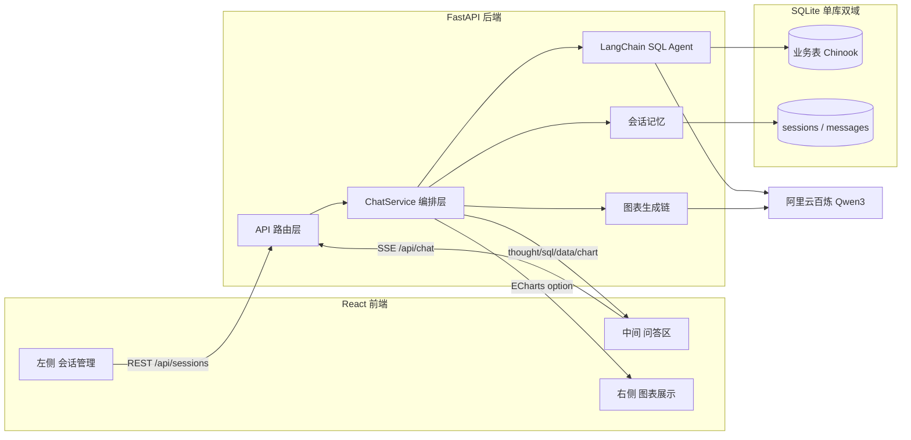
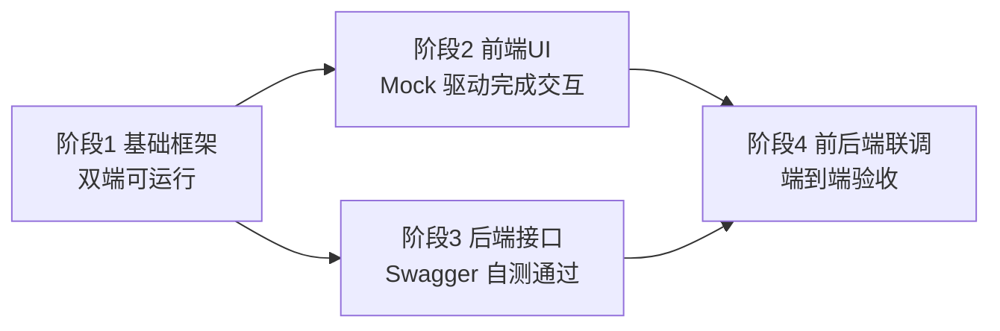

# NL2SQL 智能数据分析系统 - 模块规划

## 一、整体架构



核心流程：用户提问 → 后端加载会话历史（Memory）→ SQL Agent 多轮调用 Qwen3 自动探查 schema、生成 SQL、执行、自愈 → 结果交给图表生成链产出 ECharts option → SSE 分段推送 `thought/sql/data/chart/final` 事件给前端。

## 二、技术栈锁定

- **后端**：Python 3.11 + FastAPI + LangChain（`langchain`、`langchain-community`、`langchain-openai`） + SQLAlchemy + aiosqlite + `sse-starlette` + pydantic-settings
- **LLM 接入**：阿里云百炼 OpenAI 兼容端点 `https://dashscope.aliyuncs.com/compatible-mode/v1`，通过 `langchain_openai.ChatOpenAI` 直接对接 Qwen3（`qwen3-max` / `qwen3-plus`），`DASHSCOPE_API_KEY` 注入为 `openai_api_key`
- **数据库**：单个 `app.db`（SQLite3），内建 Chinook 示例数据集 + 应用表 `sessions` / `messages`
- **前端**：React 18 + Vite + TypeScript + Ant Design 5 + `echarts` + `echarts-for-react` + Zustand + `@microsoft/fetch-event-source`（SSE 客户端，支持 POST）

## 三、后端模块设计（FastAPI + LangChain）

目录结构：

```
backend/
  app/
    main.py                  # FastAPI 入口、CORS、路由注册
    config.py                # pydantic-settings 读取 .env
    llm/
      qwen.py                # ChatOpenAI 包装百炼 Qwen3
    db/
      engine.py              # SQLAlchemy 引擎（同一 app.db）
      models.py              # Session / Message ORM
      seed_chinook.py        # 首次启动自动建表+灌示例数据
    agent/
      sql_agent.py           # create_sql_agent + SQLDatabaseToolkit
      chart_chain.py         # 根据 columns+rows 产出 ECharts option
      prompts.py             # 系统提示词（中文、安全约束、只读）
    memory/
      sqlite_history.py      # 自定义 BaseChatMessageHistory，读写 messages 表
    services/
      chat_service.py        # 编排：取历史→跑 Agent→生成图→落库→产出 SSE 事件
      session_service.py     # 会话 CRUD
    api/
      sessions.py            # /api/sessions 会话增删改查 + 消息历史
      chat.py                # /api/chat (SSE) 核心问答
      schema.py              # /api/schema 返回业务表结构供前端展示
    schemas.py               # Pydantic 请求/响应模型
  requirements.txt
  .env.example               # DASHSCOPE_API_KEY / QWEN_MODEL / DB_PATH
```

### 3.1 关键模块要点

- **`llm/qwen.py`**：统一出口，返回 `ChatOpenAI(model=settings.qwen_model, base_url=..., api_key=...)`，区分「Agent 用模型（温度 0）」和「图表生成模型（温度 0.2）」。
- **`agent/sql_agent.py`**：使用 LangChain 官方 `SQLDatabaseToolkit` + `create_sql_agent(agent_type="openai-tools")`，在 `SQLDatabase.from_uri` 时通过 `include_tables` 白名单 + 在自定义工具中拦截 `INSERT/UPDATE/DELETE/DROP` 保证只读；把 Agent 配置为 `return_intermediate_steps=True`，便于流式吐出「思考/工具调用/SQL」。
- **`agent/chart_chain.py`**：输入 `user_question + sql + columns + rows(截断前 200 行) + summary` → 输出严格 JSON `{chartType, echartsOption, insight}`；用 `JsonOutputParser` + `PydanticOutputParser` 做结构化约束，失败回退为「表格」。
- **`memory/sqlite_history.py`**：实现 `BaseChatMessageHistory`（`add_message` / `messages` / `clear`），把每轮 Human/AI/Tool 消息持久化到 `messages` 表；通过 `RunnableWithMessageHistory` 包装 Agent，自动按 `session_id` 注入上下文。
- **`services/chat_service.py`**：生成器函数 `async def run(session_id, question)`，使用 Agent 的 `astream_events(v2)` 逐事件转成 SSE payload：
  - `thought`：Agent 中间推理
  - `sql`：从 `on_tool_start` 的 `sql_db_query` 参数抽取
  - `data`：工具返回的列/行（JSON 截断预览）
  - `chart`：调用 chart_chain 产出的 ECharts option
  - `final`：自然语言总结

### 3.2 数据库 schema（应用表）

```sql
CREATE TABLE sessions (
  id TEXT PRIMARY KEY,           -- uuid
  title TEXT NOT NULL,
  created_at DATETIME,
  updated_at DATETIME
);
CREATE TABLE messages (
  id INTEGER PRIMARY KEY AUTOINCREMENT,
  session_id TEXT NOT NULL,
  role TEXT NOT NULL,            -- user / assistant / tool
  content TEXT NOT NULL,         -- 文本或 JSON 字符串
  meta_json TEXT,                -- sql / chart_option / rows 等附加信息
  created_at DATETIME
);
```

### 3.3 API 清单

- `GET /api/sessions` 列出会话
- `POST /api/sessions` 新建会话（首问自动用 LLM 生成标题）
- `PATCH /api/sessions/{id}` 重命名
- `DELETE /api/sessions/{id}` 删除
- `GET /api/sessions/{id}/messages` 获取完整历史（含 SQL / 图表 option）
- `POST /api/chat` （SSE）请求体 `{session_id, question}`，流式返回 `event: thought|sql|data|chart|final`
- `GET /api/schema` 返回业务表名、列、前几行示例，供前端右侧「数据字典」折叠面板展示

## 四、前端模块设计（React 三栏布局）

目录结构：

```
frontend/
  src/
    App.tsx                     # 三栏 Layout（AntD）
    main.tsx
    api/
      client.ts                 # axios 基础实例
      sessions.ts               # 会话 REST
      chat.ts                   # fetch-event-source 封装 SSE
    store/
      useSessionStore.ts        # sessions 列表、currentSessionId
      useChatStore.ts           # messages、流式中间态
      useChartStore.ts          # 当前活跃图表 option、历史图表
    components/
      SessionList/              # 左侧：新建/搜索/重命名/删除
      ChatPanel/
        MessageList.tsx         # 气泡、SQL 代码块、折叠思考过程
        StreamingBubble.tsx     # 边流边渲染
        ChatInput.tsx
      ChartPanel/
        ChartRenderer.tsx       # echarts-for-react 渲染 option
        ChartTabs.tsx           # 图表 / 数据表 / SQL 三 Tab
        SchemaDrawer.tsx        # 查看业务表结构
    types.ts
    vite.config.ts
```

布局（AntD `Layout`）：

```
┌──────────┬──────────────────────────┬───────────────────┐
│ Sider    │ Content                  │ Sider             │
│ 260px    │                          │ 480px             │
│ 会话列表 │ 问答消息流 + 输入框      │ ECharts 图表 +    │
│          │ (SSE 实时气泡)           │ 数据表 / SQL Tab  │
└──────────┴──────────────────────────┴───────────────────┘
```

### 4.1 SSE 流式渲染关键点

使用 `@microsoft/fetch-event-source` 的 `fetchEventSource(url, {method:'POST', body, onmessage})` 解决 EventSource 不支持 POST 的问题；按 `event` 字段分派：`thought` 追加到当前 assistant 气泡的「思考过程」区域，`sql` 渲染为代码块，`chart` 写入 `useChartStore` 触发右侧重绘，`final` 合并到正文。

## 五、研发阶段拆分（四阶段）

采用「**契约先行 + Mock 驱动**」的策略：阶段 1 先锁定接口契约，阶段 2 前端依 Mock 独立成型，阶段 3 后端按契约落地，阶段 4 移除 Mock 对接真实服务，最大化并行度、降低联调成本。



---

### 阶段 1：搭建前后端基础框架并运行测试（预计 0.5 天）

**目标**：双端工程可独立启动，前端能请求到后端 `/api/ping`，为后续开发打好地基。

**后端任务**
- 初始化 `backend/`：`requirements.txt`（fastapi / uvicorn / pydantic-settings / python-dotenv / sse-starlette）、`.env.example`、`.gitignore`
- `app/main.py`：创建 FastAPI 实例，启用 CORS（`http://localhost:5173`），注册一个健康检查路由 `GET /api/ping -> {"pong": true, "time": ...}`
- `app/config.py`：pydantic-settings 读取 `DASHSCOPE_API_KEY` / `QWEN_MODEL` / `DB_PATH` / `CORS_ORIGINS`
- 启动命令：`uvicorn app.main:app --reload --port 8000`

**前端任务**
- `npm create vite@latest frontend -- --template react-ts`
- 安装依赖：`antd`、`echarts`、`echarts-for-react`、`zustand`、`axios`、`@microsoft/fetch-event-source`、`dayjs`
- 配置 `vite.config.ts` 代理 `/api` → `http://localhost:8000`
- `App.tsx` 搭建 AntD 三栏 `Layout`（左 Sider 260 / Content / 右 Sider 480），每栏放占位文字
- `api/client.ts` axios 实例（baseURL `/api`，超时 30s）
- 在 `App.tsx` 挂载时请求 `/api/ping`，顶部 Header 显示「后端已连接 ✓ / ✗」

**验收标准**
- 后端：访问 `http://localhost:8000/api/ping` 返回 200 JSON；Swagger `http://localhost:8000/docs` 可见
- 前端：`npm run dev` 打开 `http://localhost:5173`，看到三栏布局 + Header 绿色「后端已连接」
- 交付：`backend/` 与 `frontend/` 两个目录可独立启动

---

### 阶段 2：研发前端 UI（Mock 驱动，预计 1.5 天）

**目标**：不依赖真实后端，用 Mock 数据跑通完整交互：选择会话 → 输入问题 → 气泡流式打字 → 右侧图表渲染。

**子任务 2.1 状态与 Mock 层**
- `store/useSessionStore.ts`：`sessions / currentSessionId / createSession / renameSession / deleteSession`
- `store/useChatStore.ts`：`messagesBySession / streaming / appendDelta / finalize`
- `store/useChartStore.ts`：`currentOption / history / setOption`
- `mocks/mockApi.ts`：`listSessions / createSession / fetchMessages` 返回预设数据（延时 300ms 模拟网络）
- `mocks/mockSSE.ts`：`runMockChat(question, onEvent)`，用 `setTimeout` 按 200ms 节奏依次发射 `thought / sql / data / chart / final` 五种事件；内置 3 条样例（销售 TOP10 柱图、月度销售折线、流派占比饼图），并附对应 ECharts option

**子任务 2.2 左侧 SessionList**
- AntD `List` + 搜索框 + 「新建会话」按钮
- 每项：标题、更新时间、右键/更多菜单「重命名 / 删除」
- 高亮当前激活会话

**子任务 2.3 中间 ChatPanel**
- `MessageList.tsx`：用户气泡（靠右蓝底）+ 助手气泡（靠左白底，带 Avatar）
- `StreamingBubble.tsx`：流式显示
  - 「思考过程」可折叠 Collapse（灰字）
  - SQL：AntD 代码块样式 + 一键复制按钮
  - 数据预览：AntD `Table`（最多 10 行）
  - 最终回答：Markdown 渲染
- `ChatInput.tsx`：多行输入 + 发送按钮（Enter 发送，Shift+Enter 换行）+ 停止生成按钮

**子任务 2.4 右侧 ChartPanel**
- `ChartTabs.tsx`：Tabs [图表 / 数据表 / SQL]
- `ChartRenderer.tsx`：`ReactECharts` 自适应容器尺寸；空态占位
- `SchemaDrawer.tsx`：顶部按钮「数据字典」→ 右侧抽屉展示 Mock 的表结构

**子任务 2.5 交互打磨**
- 发送后自动滚动到底、生成过程中输入框禁用
- 骨架屏（Skeleton）、空态插画、错误 Toast

**验收标准**
- 无需后端，整套 UI 在 `npm run dev` 下可完整演示 3 条预设问答，含流式气泡与三种不同图表
- 所有 API 调用都走 `mocks/*`，后续替换一处即可切换到真实 API

---

### 阶段 3：研发后端接口（预计 2 天）

**目标**：按前端已使用的契约，逐个实现 REST 与 SSE 接口，在 Swagger 中自测通过。

**子任务 3.1 数据与基础设施**
- `app/db/engine.py`：SQLAlchemy `create_engine("sqlite:///./app.db")`，`SessionLocal`
- `app/db/models.py`：`Session` / `Message` ORM
- `app/db/seed_chinook.py`：启动钩子，若未建业务表则下载/读取打包的 Chinook SQL 脚本并执行
- `app/schemas.py`：Pydantic DTO（SessionOut / MessageOut / ChatRequest / SchemaOut）

**子任务 3.2 LLM 与 Agent**
- `app/llm/qwen.py`：`get_llm(temperature)` 返回 `ChatOpenAI(model=..., base_url="https://dashscope.aliyuncs.com/compatible-mode/v1", api_key=...)`
- `app/agent/prompts.py`：中文系统提示词（角色、只读约束、输出规范）
- `app/agent/sql_agent.py`：`build_sql_agent(session_id)` → `create_sql_agent(llm, toolkit=SQLDatabaseToolkit(db=readonly_db), agent_type="openai-tools", return_intermediate_steps=True)`；自定义 `SafeQuerySQLTool` 拦截写操作
- `app/agent/chart_chain.py`：LCEL Chain，输入 `question/sql/columns/rows` → 输出 `{chartType, echartsOption, insight}`，外层 `OutputFixingParser`

**子任务 3.3 会话与记忆**
- `app/memory/sqlite_history.py`：`SqliteChatMessageHistory(session_id)` 实现 `add_message / messages / clear`，用 JSON 持久化 meta
- `app/services/session_service.py`：`list / create / rename / delete / list_messages`
- `app/api/sessions.py`：
  - `GET /api/sessions`
  - `POST /api/sessions`（body: `{title?}`，不传则默认「新会话」）
  - `PATCH /api/sessions/{id}`
  - `DELETE /api/sessions/{id}`
  - `GET /api/sessions/{id}/messages`

**子任务 3.4 Schema 接口**
- `app/api/schema.py`：`GET /api/schema` 反射业务表，返回 `[{table, columns:[{name,type}], sampleRows}]`

**子任务 3.5 SSE 问答接口**
- `app/services/chat_service.py`：`async def stream_chat(session_id, question)` 生成器，利用 `agent.astream_events(v2)` 分发：
  - `on_chain_start / on_chat_model_stream` → `event: thought`
  - `on_tool_start`（`sql_db_query`） → `event: sql`
  - `on_tool_end`（`sql_db_query`） → `event: data`（含 columns/rows，截断 200 行）
  - 末尾调用 chart_chain → `event: chart`
  - 总结文本 → `event: final`
  - 全程把关键消息落库到 `messages`
- `app/api/chat.py`：`POST /api/chat` 使用 `sse_starlette.EventSourceResponse` 返回

**验收标准**
- Swagger 中每个接口可手工调用成功；`/api/chat` 用 `curl -N` 能看到五类事件流
- 用真实 Qwen3 Key 至少跑通 3 条典型问题且结果合理

---

### 阶段 4：前后端联调（预计 1 天）

**目标**：移除 Mock，用真实后端替代，解决跨端细节差异，完成端到端验收。

**任务清单**
- 前端将 `mocks/mockApi.ts` 替换为真实 `api/sessions.ts`、`api/schema.ts`，仅保留同样的对外函数签名
- 前端将 `mocks/mockSSE.ts` 替换为 `api/chat.ts`（`fetchEventSource`），统一事件字段与前端 `StreamingBubble` 消费逻辑一致
- 对齐字段命名（camelCase vs snake_case）：统一后端出参用 `camelCase`（`response_model_by_alias=True` + `populate_by_name=True`）
- 核查 CORS、SSE `Content-Type: text/event-stream`、Nginx/反代下的 `X-Accel-Buffering: no`
- 端到端场景回归：
  1. 新建会话 → 输入「销售额 TOP10 艺人」→ 看到 thought/sql/data/chart/final 完整流 → 右侧柱图
  2. 同一会话追问「换成折线图看月度趋势」→ 验证上下文记忆生效
  3. 切换会话 → 历史消息与图表可回放（从 `/api/sessions/{id}/messages` 拉取 meta_json 中的 option 重绘）
  4. 删除会话 → 列表更新、消息不可见
- 错误与降级：后端 500 / Qwen 超时 / 非法 SQL 响应在前端有友好提示
- 编写 `README.md`（根目录、backend、frontend 各一份），含 `.env.example`、一键启动脚本（根目录 `dev.ps1` / `dev.sh` 并行启前后端）

**验收标准**
- 从零启动：填 Key → 启动后端 → 启动前端 → 浏览器内完成上述 4 个场景全部通过
- 生产构建：`npm run build` 产物可被 FastAPI 作为静态资源托管（`/` 路径），单端口对外

## 六、风险与对策

- **Qwen3 输出非严格 JSON**：chart_chain 使用 `OutputFixingParser` 自愈；失败降级为数据表
- **SQL 注入/破坏性语句**：`SQLDatabase` 不暴露写操作工具；自定义 `QuerySQLDataBaseTool` 子类中正则拦截 `(?i)\b(insert|update|delete|drop|alter|truncate)\b`
- **大结果集**：后端对行数 > 1000 截断，并在图表链提示「已采样」；前端数据表开启虚拟滚动
- **Agent token 超限**：Memory 使用 `ConversationSummaryBufferMemory` 策略（保留最近 N 轮 + 旧对话摘要）
